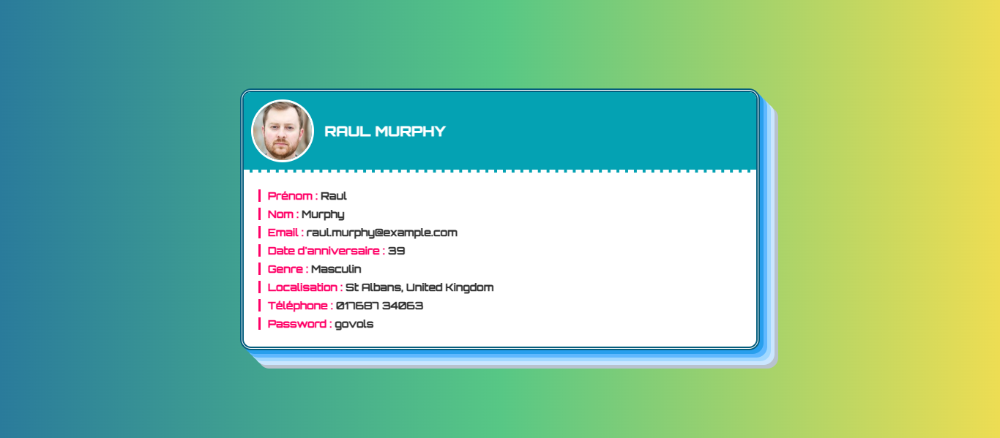

# 🎴 Random User – Mini Projet Web

Bienvenue dans ce petit projet web moderne !  
L’objectif est de **générer des cartes de visite dynamiques** à partir d’une API publique, avec un style épuré, animé et responsive.

---

## ✨ Fonctionnalités

- Appel automatique à l'API [`randomuser.me`](https://randomuser.me/)
- Génération **de plusieurs utilisateurs aléatoires**
- Affichage de **cartes de visite interactives** (avec animations et hover)
- Utilisation de **HTML / CSS / JavaScript moderne**
- Intégration d’un **loader CSS** pendant le chargement
- Design responsive, adapté à tous les écrans

---

## 🧠 Technologies utilisées

- **HTML** – Structure de la page
- **CSS** – Mise en forme moderne avec animations
- **JavaScript** – Requêtes API & génération dynamique de contenu
- API : [https://randomuser.me/api](https://randomuser.me/api)

---
